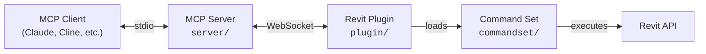

[](https://github.com/MrGezz/mcp-servers-for-revit)

# mcp-servers-for-revit

**Connect AI assistants to Autodesk Revit via the Model Context Protocol.**

mcp-servers-for-revit enables AI clients like Claude, Cline, and other MCP-compatible tools to read, create, modify, and delete elements in Revit projects. It consists of three components: a TypeScript MCP server that exposes tools to AI, a C# Revit add-in that bridges commands into Revit, and a command set that implements the actual Revit API operations.

> [!NOTE]
> This is the [MrGezz](https://github.com/MrGezz/mcp-servers-for-revit) fork of the original [revit-mcp](https://github.com/mcp-servers-for-revit/revit-mcp) project, with additional tools and functionality improvements. Its install steps differ from the original's (bundled MCP server, socket that starts with Revit, lean tool profile), so follow this README rather than the upstream one.

## Architecture



The **MCP Server** (TypeScript) translates tool calls from AI clients into WebSocket messages. The **Revit Plugin** (C#) runs inside Revit, listens for those messages, and dispatches them to the **Command Set** (C#), which executes the actual Revit API operations and returns results back up the chain.

## Requirements

- **Node.js 20+** (for the MCP server; the installer warns below 20)
- **Autodesk Revit 2020 - 2027** (any supported version)

## Quick Start (Installer)

Download `mcp-servers-for-revit-<version>-Setup.exe` from the
[Releases](https://github.com/MrGezz/mcp-servers-for-revit/releases) page and run it.

It ticks the Revit versions it finds on the machine, refuses to run while Revit
is open (the add-in DLLs are loaded and cannot be replaced), and installs to
`%AppData%\Autodesk\Revit\Addins\<year>\` with no administrator rights.

**Use the installer rather than the ZIP if you can.** Windows marks files
extracted from a downloaded archive, and the .NET loader then refuses the DLL
with `FileLoadException ... HRESULT 0x80131515`, which Revit reports only as
"cannot run the external application". Measured on Windows 11:

| How the payload arrives | Mark left on the DLL |
| --- | --- |
| ZIP, extracted with Explorer's **Extract All** | `ZoneId=3` — the add-in fails to load |
| ZIP, extracted with PowerShell `Expand-Archive` | none |
| **Setup.exe** | none |

That difference is why the failure looks intermittent between users. The
installer avoids it entirely; if you use the ZIP, unblock it *before* extracting.

Then register the MCP server with your AI client — see
[MCP Server Setup](#mcp-server-setup). The Revit add-in is only half of it.

## Quick Start (Using a Release ZIP)

Every release carries both the `Setup.exe` and one ZIP per Revit version, on
purpose: the installer bundles all eight Revit builds plus the MCP server and
is correspondingly large, and people who are comfortable copying an add-in
folder by hand tend to prefer the small ZIP for just their Revit year. The
per-year ZIPs are produced by the release workflow when a `v*` tag is pushed;
the installer is built locally with `tools\Make-Installer.ps1`.

A ZIP install is only the Revit half. Take the matching MCP server from the
same release (`mcp-servers-for-revit-vX.Y.Z-server.zip`) rather than `npx`:
the package on the npm registry is published from the upstream repository and
can lag this fork by a whole tool set.

1. Download the ZIP for your Revit version from the [Releases](https://github.com/MrGezz/mcp-servers-for-revit/releases) page (e.g., `mcp-servers-for-revit-v1.0.2-Revit2026.zip`)

2. Extract the ZIP and copy the contents to your Revit addins folder:
   ```
   %AppData%\Autodesk\Revit\Addins\<your Revit version>\
   ```
   After copying you should have:
   ```
   Addins/2025/
   ├── mcp-servers-for-revit.addin
   └── revit_mcp_plugin/
       ├── RevitMCPPlugin.dll
       ├── ...
       └── Commands/
           └── RevitMCPCommandSet/
               ├── command.json
               └── 2025/
                   ├── RevitMCPCommandSet.dll
                   └── ...
   ```

3. Configure the MCP server in your AI client (see [MCP Server Setup](#mcp-server-setup))

4. Start Revit — if prompted about an unknown add-in, click **Always Load**

5. Nothing to start. The server **starts automatically** every time Revit
   starts, so nobody has to press a button before an AI client can connect.
   The **Revit MCP Switch** on the mcp-servers-for-revit ribbon tab is a
   toggle: clicking it while the server runs *stops* it, clicking again starts
   it.

   To keep the server off until the switch is pressed, set `"autoStart": false`
   in the `settings` block of `revit_mcp_plugin\Commands\commandRegistry.json`,
   or set the environment variable `REVIT_MCP_AUTOSTART=0` before starting Revit.

6. Optional: the **Settings** button on the same tab edits the command
   registry (`revit_mcp_plugin\Commands\commandRegistry.json`). The add-in
   creates that file on its first start with **every deployed command
   enabled**, and adds newly deployed commands to it after an upgrade, so a
   fresh install needs no visit here. Use it to switch commands off. Commands
   are bound when the server starts, so after saving either restart Revit or
   toggle the switch off and on.

7. Check it from your AI client by asking it to call `get_current_view_info`. It
   should return the active view.

   | What you see | What it means |
   | --- | --- |
   | The active view is returned | Working |
   | `Method '...' not found` | that command is missing or disabled in `revit_mcp_plugin\Commands\commandRegistry.json` (the log in `revit_mcp_plugin\Logs` names it); open Settings, tick it, Save, then toggle the switch off and on |
   | Connection refused / `ECONNREFUSED` | Revit is not running, auto-start is disabled and the switch is off, or the log in `revit_mcp_plugin\Logs` shows why port 8080 could not be bound |

## MCP Server Setup

There are three ways to run the server. Pick the one that matches how you
installed the add-in:

| You installed with | Run the server from | How it is registered |
| --- | --- | --- |
| `Setup.exe` | the bundled copy in `%APPDATA%\mcp-servers-for-revit\server\build\index.js` | the installer's "Register the MCP server" task writes a `node <that path>` entry (or run `tools\Set-RevitMcpTarget.ps1` later) |
| a per-year ZIP | `mcp-servers-for-revit-vX.Y.Z-server.zip` from the same release, extracted anywhere | add a `node <extracted>\build\index.js` entry by hand (same JSON shape as below, with `"command": "node"`) |
| nothing yet, just trying it | `npx -y mcp-server-for-revit` | the commands below |

> [!IMPORTANT]
> `npx -y mcp-server-for-revit` runs whatever is on the **npm registry**, which
> is published by the upstream repository's release workflow, not by this fork.
> It can be a version behind with far fewer tools, and its tool schemas will
> not match a newer add-in. Use it only when nothing else is installed.

The upstream project publishes the server to npm, which is what `npx` runs. This fork does not publish to npm (the job is disabled in `release.yml`); its server ships inside the installer and as the release's `-server.zip`.

**Claude Code**

Run this in a **terminal** (not inside Claude Code), pointing at the server
the installer put under `%AppData%` (or at the extracted `-server.zip`):

```bash
claude mcp add --scope user mcp-server-for-revit -- node "C:\Users\<you>\AppData\Roaming\mcp-servers-for-revit\server\build\index.js"
```

The installer's "Register the MCP server" task runs exactly this for you. To
try the upstream npm package instead, use
`claude mcp add --scope user mcp-server-for-revit -- cmd /c npx -y mcp-server-for-revit`.

`--scope user` registers the server for every project. Without it the scope
defaults to `local`, which registers it only for the directory the command was
run in — which is why the tools sometimes appear in one project and are missing
in the next.

**If `claude` is not found, the CLI is not on your `PATH`.** Installed and
on the `PATH` are not the same thing, so check rather than assume:

```bash
claude --version
```

If that fails you have two options. Either call the executable by its full path —
the Windows native install puts it at
`%AppData%\Claude\claude-code\<version>\claude.exe` — or skip the CLI and add
the entry by hand to `~/.claude.json` (`%UserProfile%\.claude.json` on
Windows) under its top-level `mcpServers` key. That file, not
`~/.claude/settings.json`, is where Claude Code keeps user-scope MCP servers:

```json
{
    "mcpServers": {
        "mcp-server-for-revit": {
            "type": "stdio",
            "command": "node",
            "args": ["C:\\Users\\<you>\\AppData\\Roaming\\mcp-servers-for-revit\\server\\build\\index.js"]
        }
    }
}
```

Merge that into the existing `mcpServers` object rather than replacing the file,
and restart Claude Code afterwards.

**On macOS and Linux, drop the `cmd /c`** and use `-- npx -y mcp-server-for-revit`.
The wrapper is needed only on Windows, where `npx` is a `.cmd` shim and cannot be
launched directly as a process.

**Claude Desktop**

Claude Desktop → Settings → Developer → Edit Config → `claude_desktop_config.json`.
The installer writes this entry for you when Claude Desktop is closed; to run
the upstream npm package instead, use `"command": "cmd"` with
`"args": ["/c", "npx", "-y", "mcp-server-for-revit"]`:

```json
{
    "mcpServers": {
        "mcp-server-for-revit": {
            "command": "node",
            "args": ["C:\\Users\\<you>\\AppData\\Roaming\\mcp-servers-for-revit\\server\\build\\index.js"]
        }
    }
}
```

Restart Claude Desktop. When you see the hammer icon, the MCP server is connected.


## Revit Plugin Setup

If using a release ZIP, the plugin is already included. For manual installation:

1. Build the plugin from `plugin/` (see [Development](#development))
2. Copy `mcp-servers-for-revit.addin` to `%AppData%\Autodesk\Revit\Addins\<version>\`
3. Copy the `revit_mcp_plugin/` folder to the same addins directory

## Command Set Setup

If using a release ZIP, the command set is pre-installed inside the plugin. For manual installation:

1. Build the command set from `commandset/` (see [Development](#development))
2. Inside the plugin's installation directory, create `Commands/RevitMCPCommandSet/<year>/`
3. Copy the built DLLs into that folder
4. Copy `command.json` (from repo root) into `Commands/RevitMCPCommandSet/`

## Token usage and tool profiles

An MCP client sends the **whole tool catalogue** — every name, description and
JSON schema — to the model on every request of every turn. With all 100+ tools
loaded that catalogue measured about **32,000 tokens** (115 KB of JSON), before
the conversation itself, and every result came back as 2-space-indented JSON.
On a free-tier client that is most of the budget gone before the first word.

Since v1.0.2 the server registers everything but **enables only a lean core**
of 14 tools (about 3,000 tokens): connection test, current view, selection,
element search, parameters, family types, C# execution, delete, element
operations, Dynamo status/run, and `revit_tools`. The rest is one call away:

```text
revit_tools {action: "list"}                       -> every group, what it covers, on/off
revit_tools {action: "enable", groups: ["views"]}  -> the group's tools become callable at once
```

The server sends `notifications/tools/list_changed`, and clients that honour it
(Claude Desktop, Cline) refresh the catalogue immediately. Claude Code reads the
catalogue once per session (measured 2026-09-03: tools enabled mid-session are not
callable there), so give it `REVIT_MCP_PROFILE=full` or preset `REVIT_MCP_TOOLS`. The
server's `instructions` tell the model this, so it does it on its own.

| Group | Covers |
| --- | --- |
| `core` | always on (see above) |
| `query` | geometry, references, view range, clashes, model statistics, material and room takeoffs |
| `arch` | walls, floors, ceilings, roofs, columns, stairs, railings, openings, rooms, spaces, levels, grids, beams, curves, groups, shapes, family instances |
| `mep` | ducts, pipes, conduits, equipment, systems, connections |
| `views` | views, sheets, schedules, templates, filters, overrides, colouring, export |
| `annotate` | dimensions, tags, text, detail lines, filled regions, revisions |
| `modify` | move/copy/rotate/mirror, rename, curves, duplicate type, family and project parameters, save |
| `dynamo` | list/read/edit `.dyn` files (running graphs is in core) |
| `memory` | knowledge memory and project memory |

Environment variables (set them on the MCP server entry in your client config):

| Variable | Effect |
| --- | --- |
| `REVIT_MCP_PROFILE` | `core` (default), `standard` (core + query + modify + annotate) or `full` (everything, the pre-1.0.2 behaviour — use it for a client that ignores `list_changed`) |
| `REVIT_MCP_TOOLS` | groups to add at start-up, e.g. `views,mep`; prefix `-` to drop one |
| `REVIT_MCP_MAX_RESULT_CHARS` | cap on any single result (default 20000). Oversized arrays are cut to whole records and marked `_truncated` |
| `REVIT_MCP_KEEP_UNIQUE_IDS` | `1` keeps the 45-character `UniqueId` strings in element listings (dropped by default; no tool needs them) |

Results are compact JSON with nulls and empty strings pruned and floats rounded
to 0.001 mm. Listing tools default to 30 records and always report the total.
Every failure carries `isError` and `{"ok": false, "error": ...}`, so a model
cannot mistake an error text for a success.

## Supported Tools

The **Group** column is the `revit_tools` group that switches a tool on
(`core` is always on; see *Token usage and tool profiles* above). The
section headings follow the groups where a tool's purpose allows; the
column is what counts.

### General

| Tool | Group | Description |
| ---- | ----- | ----------- |
| `revit_tools` | `core` | List, enable or disable tool groups; describe a tool |
| `say_hello` | `core` | Connection test: Revit version and open document (no dialog unless asked) |
| `send_code_to_revit` | `core` | Compile and run a C# snippet inside Revit via Roslyn |

### Query & Selection

| Tool | Group | Description |
| ---- | ----- | ----------- |
| `get_current_view_info` | `core` | Get current active view info (name, type, scale, detail level) |
| `get_current_view_elements` | `core` | Elements in the active view: id, name, category, family/type names, location in mm (`LocationMm`, `StartMm`/`EndMm`/`LengthMm`); default 30 records |
| `get_selected_elements` | `core` | Get currently selected elements |
| `get_available_family_types` | `core` | Get available family types in current project |
| `ai_element_filter` | `core` | Intelligent element querying tool with multiple filter criteria |
| `query_parameters` | `core` | Get all parameters of an element with name, value, and storage type |
| `query_geometry` | `query` | Get geometry of an element including bounding box, solids, and faces |
| `query_references` | `query` | Get stable geometric references for dimensioning and tagging |
| `check_interferences` | `query` | Check interference collisions between specified elements |
| `query_view_range` | `query` | Get the view range of a plan view |

### Create — Architecture

| Tool | Group | Description |
| ---- | ----- | ----------- |
| `create_wall` | `arch` | Create straight or arc walls (`midPoint`) with start/end points, height, base level and type |
| `create_floor` | `arch` | Create floors from a boundary polygon and level; thickness comes from the floor type |
| `create_ceiling` | `arch` | Create ceilings from a boundary and level; thickness comes from the ceiling type |
| `create_roof` | `arch` | Create footprint or extrusion roofs from a boundary and level, with an `options` map for shape details |
| `create_column` | `arch` | Create architectural or structural columns at specified locations |
| `create_stair` | `arch` | Create straight-run stairs from base/top levels and a run line (`startPoint`/`endPoint` or `pathPoints`); riser/tread come from the type |
| `create_ramp` | `arch` | Not supported by the Revit API (2022-2027); returns an explanatory error instead of failing later |
| `create_railing` | `arch` | Create railings along a path with height and type |
| `create_opening` | `arch` | Create openings in walls (with `sillHeight`), floors and roofs |
| `create_model_curve` | `arch` | Create model lines, arcs, circles or splines from a `points` array |
| `create_reference_plane` | `arch` | Create reference planes by line (`bubbleEnd`/`freeEnd`), by origin+normal, or by points |
| `create_group` | `arch` | Create a group from selected element IDs |
| `create_grid` | `arch` | Create a grid system with smart spacing generation |
| `create_level` | `arch` | Create levels at specified elevations |
| `create_room` | `arch` | Create and place rooms at specified locations |
| `create_structural_framing_system` | `arch` | Create a structural beam framing system |
| `create_line_based_element` | `arch` | Create line-based elements (wall, beam, pipe) — generic |
| `create_point_based_element` | `arch` | Create point-based elements (door, window, furniture) — generic |
| `create_surface_based_element` | `arch` | Create surface-based elements (floor, ceiling, roof) — generic |
| `create_space` | `arch` | Create MEP spaces at specified locations |
| `create_direct_shape` | `arch` | Create primitive solid geometry (box, cylinder, extrusion) as DirectShape |
| `create_swept_shape` | `arch` | Create swept solids along a path with section profiles |

### Create — MEP

| Tool | Group | Description |
| ---- | ----- | ----------- |
| `create_duct` | `mep` | Create ducts with start/end points, width, height, and system type |
| `create_pipe` | `mep` | Create pipes with start/end points, diameter, and system type |
| `create_conduit` | `mep` | Create conduits with start/end points and diameter |
| `create_equipment` | `mep` | Place MEP equipment at specified locations with rotation |
| `create_mep_curve` | `mep` | Create MEP curve elements (duct/pipe/conduit) — multi-type |
| `connect_mep` | `mep` | Connect two MEP elements by their connectors |
| `create_mep_system` | `mep` | Create MEP systems from selected elements |

### Annotation

| Tool | Group | Description |
| ---- | ----- | ----------- |
| `create_dimensions` | `annotate` | Create dimension annotations between elements or points |
| `create_text_note` | `annotate` | Create text notes in views with content, position, and alignment |
| `create_tag` | `annotate` | Create independent tags for elements (doors, windows, walls, rooms) |
| `tag_all_walls` | `annotate` | Tag all walls in the current view |
| `tag_all_rooms` | `annotate` | Tag all rooms in the current view |
| `create_filled_region` | `annotate` | Create a filled region in a view with boundary points |
| `create_revision` | `annotate` | Create a revision record with name, date, and number |
| `create_revision_cloud` | `annotate` | Create a revision cloud in a view associated with a revision |
| `create_detail_curve` | `annotate` | Create detail lines in a view |

### Views & Sheets

| Tool | Group | Description |
| ---- | ----- | ----------- |
| `create_view` | `views` | Create views (floor plan, ceiling plan, elevation, section, 3D) |
| `create_drafting_view` | `views` | Create a drafting view with specified name and scale |
| `create_section_view` | `views` | Create a section view with bounding box |
| `create_elevation_view` | `views` | Create an elevation view at a direction index |
| `create_callout` | `views` | Create a callout view from a host view |
| `duplicate_view` | `views` | Duplicate a view with duplicate, with detailing, or dependent mode |
| `create_view_template` | `views` | Create a view template from a source view |
| `create_sheet` | `views` | Create sheets with number, name, and optional title block |
| `place_view_on_sheet` | `views` | Place a view onto a sheet at a specified location |
| `create_schedule` | `views` | Create schedules (regular, material, keynote, view/sheet/revision list); fields, filters and sorting are not yet applied (see `manage_schedule_fields`) |
| `place_schedule_on_sheet` | `views` | Place an existing schedule on a sheet |
| `set_view_properties` | `views` | Set view properties (scale, detail level, crop box, display style, template) |
| `set_category_overrides` | `views` | Set graphic overrides for a category in a view |
| `manage_view_filters` | `views` | Add or remove view filters with visibility and overrides |
| `set_view_range` | `views` | Set the plan view range offsets |
| `manage_schedule_fields` | `views` | Add, remove, reorder, or hide schedule fields |
| `manage_graphics_resources` | `views` | Manage line styles and fill patterns |
| `color_elements` | `views` | Color elements based on a parameter value |

### Modify

| Tool | Group | Description |
| ---- | ----- | ----------- |
| `operate_element` | `core` | Operate on elements (select, setColor, hide, isolate, etc.) |
| `delete_element` | `core` | Delete elements by ID |
| `set_parameters` | `core` | Batch set parameters on elements with key-value pairs |
| `transform_elements` | `modify` | Move, copy, rotate, or mirror elements |
| `rename_element` | `modify` | Rename a Revit element (level, grid, view, type) |
| `set_element_curve` | `modify` | Modify location curve of linear elements |
| `duplicate_type` | `modify` | Duplicate an element type with a new name |
| `manage_family_parameters` | `modify` | Add, rename, remove, or set formulas on family parameters |
| `manage_project_parameters` | `modify` | List or add shared parameters to the project |

### Family

| Tool | Group | Description |
| ---- | ----- | ----------- |
| `load_family` | `arch` | Load a family .rfa file into the current project |
| `place_family_instance` | `arch` | Place family instances (unhosted, hosted, face-based, workplane-based) |

### Analysis & Data

| Tool | Group | Description |
| ---- | ----- | ----------- |
| `analyze_model_statistics` | `query` | Analyze model complexity with element counts by category, type, family, and level |
| `export_room_data` | `query` | Export rooms with metric values: `areaM2`, `volumeM3`, `perimeterMm`, `unboundedHeightMm`, plus a placed/unplaced/not-enclosed status |
| `get_material_quantities` | `query` | Material takeoff per material: `areaM2`, `volumeM3`, element count (unknown category names are errors, not ignored) |
| `export_views` | `views` | Export views to files (PNG, JPG, DWG, DXF, IFC) |

### Document

| Tool | Group | Description |
| ---- | ----- | ----------- |
| `save_document` | `modify` | Save the current Revit document |

### Stored project data

| Tool | Group | Description |
| ---- | ----- | ----------- |
| `store_project_data` | `memory` | Store project metadata in the open model |
| `store_room_data` | `memory` | Store room metadata in the open model, linked to its project |
| `query_stored_data` | `memory` | Query stored project and room data |

These three no longer use a local SQLite file. They write through the project
memory layer below, into the Revit document itself. See **Memory** for why.

### Memory

Two layers, both package-wide.

**Knowledge memory** is durable and user-scoped: node chains, API recipes, tool
behaviour, team conventions, and anything bulk-loaded from a document. It answers
"have we worked this out before?" so a session does not research it again. It needs
no Revit connection.

| Tool | Group | Description |
| ---- | ----- | ----------- |
| `knowledge_search` | `memory` | Search stored knowledge across every namespace, with the matched terms returned |
| `knowledge_get` | `memory` | Read one knowledge unit in full |
| `knowledge_add` | `memory` | Store something worth not re-deriving, with its failure mode |
| `knowledge_ingest` | `memory` | Bulk-load a `.md`, `.txt`, `.json` or `.csv` reference document into searchable units |
| `knowledge_stats` | `memory` | What the store holds and where it lives on disk |

**Project memory** is model-scoped: an entity/relation graph written INTO the Revit
document through Extensible Storage, so it travels with the file through Save As,
worksharing and transmittal instead of desynchronising from it.

| Tool | Group | Description |
| ---- | ----- | ----------- |
| `project_memory_write` | `memory` | Record entities and relations about this model |
| `project_memory_query` | `memory` | Search them, reporting how many were searched as well as how many matched |
| `project_memory_stats` | `memory` | Counts by kind, and where the graph is stored |
| `project_memory_clear` | `memory` | Remove the graph from the model (requires `confirm: true`) |

The older `store_project_data`, `store_room_data` and `query_stored_data` still work
and now write through this layer. They previously used a SQLite file resolved
relative to the package directory, which under `npx -y` lives inside the npm cache -
so data described as persisted was sitting in storage npm may clear without warning.

### Dynamo

Read and write Dynamo graphs, and drive Dynamo inside a running Revit.

The first three work entirely from the `.dyn` file — **Revit does not need to be running**,
and Dynamo does not need to be installed.

| Tool | Group | Description |
| ---- | ----- | ----------- |
| `dynamo_read_graph` | `dynamo` | Explain a `.dyn`/`.dyf`: every node with what feeds it and what it feeds, Python and Code Block bodies, Player inputs, package dependencies, structural problems |
| `dynamo_list_graphs` | `dynamo` | List the graphs under a folder, optionally with each one's name, description, node count and packages |
| `dynamo_edit_graph` | `dynamo` | Apply edits to a graph: rewrite Python/Code Block bodies, rewire nodes, change input values, add or remove nodes, rename and reposition |
| `dynamo_status` | `core` | Report whether Dynamo is installed and running, and which graph is open; `launch: true` starts it |
| `dynamo_run_graph` | `core` | Open a graph in Dynamo (starting Dynamo first if needed) and, with `confirm: true`, run it |

**Cold start needs nobody.** Dynamo's model only exists once Dynamo has been
opened, and before v1.0.2 that meant a person clicking *Manage > Dynamo* before
any graph could be opened or run from the MCP side. The command set now posts
Revit's own `ID_VISUAL_PROGRAMMING_DYNAMO` command — the exact equivalent of
that click — and the server polls until the model answers (measured: about
14 seconds on Revit 2026 / Dynamo 3.6). `dynamo_run_graph` does this
automatically; `dynamo_status {launch: true}` does it on request.

**Editing preserves the file.** A graph is mutated in place and written back with everything
the editor did not touch left exactly as it was — including the `View` block that holds the
canvas layout, and including numeric literals, so a one-value change produces a one-line diff
rather than a few hundred. This is verified against a corpus of real graphs by
`server/src/dynamo/selfTest.ts`:

```bash
node build/dynamo/selfTest.js /path/to/a/folder/of/graphs
```

**Running a graph cannot be undone.** Every other write in this project can be wrapped in a
Revit transaction and rolled back. A Dynamo graph opens and commits its own transactions, so
there is nothing to roll back into — `dynamo_run_graph` requires `confirm: true` rather than
offering a dry run that could not work.

#### Live backends

`dynamo_status` and `dynamo_run_graph` need a live Revit session. By default they use
this project's own plugin socket — nothing else is required.

| Backend | Transport | Needs |
| ------- | --------- | ----- |
| `native` (default) | this project's plugin socket, via the `dynamo_op` command | the add-in loaded (its server starts with Revit) |
| `http` (optional) | `POST` to a URL you configure | `REVIT_MCP_DYNAMO_HTTP_URL` set to your own bridge |

The `http` backend is an escape hatch for sites that already run their own bridge into
Revit. It is off unless you set the URL, and this project ships no such endpoint.
The contract is deliberately tiny:

```http
POST <REVIT_MCP_DYNAMO_HTTP_URL>
Content-Type: application/json

{ "op": "status" | "launch" | "open" | "run", ... }
```

answered with `{ "ok": true, ... }` or `{ "ok": false, "message": "..." }`. The verb
travels in `op` rather than the URL path, which is what lets either backend serve the
same tools.

`REVIT_MCP_DYNAMO_BACKEND` is `auto` by default — use the HTTP bridge if one is
configured, otherwise native. Set it to `native` or `http` to pin one and get that
backend's error directly instead of a summary of both.

## Testing

The test project uses [Nice3point.TUnit.Revit](https://github.com/Nice3point/RevitUnit) to run integration tests against a live Revit instance. No separate addin installation is required — the framework injects into the running Revit process automatically.

### Prerequisites

- **.NET 10 SDK** — required by Nice3point.Revit.Sdk 6.1.0. Install via `winget install Microsoft.DotNet.SDK.10`
- **Autodesk Revit 2026** (or 2025) — must be installed and licensed on your machine

### Running Tests

1. Open Revit 2026 (or 2025) and wait for it to fully load
2. Run the tests from the command line:

```bash
# For Revit 2026
dotnet test -c Debug.R26 -r win-x64 tests/commandset

# For Revit 2025
dotnet test -c Debug.R25 -r win-x64 tests/commandset
```

> **Note:** The `-r win-x64` flag is required on ARM64 machines because the Revit API assemblies are x64-only.

Alternatively, you can use `dotnet run`:

```bash
cd tests/commandset
dotnet run -c Debug.R26
```

### IDE Support

- **JetBrains Rider** — enable "Testing Platform support" in Settings > Build, Execution, Deployment > Unit Testing > Testing Platform
- **Visual Studio** — tests should be discoverable through the standard Test Explorer

### Test Structure

| Directory | Purpose |
|-----------|---------|
| `tests/commandset/AssemblyInfo.cs` | Global `[assembly: TestExecutor<RevitThreadExecutor>]` registration |
| `tests/commandset/Architecture/` | Tests for level and room creation commands |
| `tests/commandset/DataExtraction/` | Tests for model statistics, room data export, and material quantities |
| `tests/commandset/ColorSplashTests.cs` | Tests for color override functionality |
| `tests/commandset/TagRoomsTests.cs` | Tests for room tagging functionality |

### Writing New Tests

Test classes inherit from `RevitApiTest` and use TUnit's async assertion API:

```csharp
public class MyTests : RevitApiTest
{
    private static Document _doc;

    [Before(HookType.Class)]
    [HookExecutor<RevitThreadExecutor>]
    public static void Setup()
    {
        _doc = Application.NewProjectDocument(UnitSystem.Imperial);
    }

    [After(HookType.Class)]
    [HookExecutor<RevitThreadExecutor>]
    public static void Cleanup()
    {
        _doc?.Close(false);
    }

    [Test]
    public async Task MyTest_Condition_ExpectedResult()
    {
        var elements = new FilteredElementCollector(_doc)
            .WhereElementIsNotElementType()
            .ToElements();

        await Assert.That(elements.Count).IsGreaterThan(0);
    }
}
```

## Building a release

```powershell
# Per-Revit-version folders and ZIPs in dist\
powershell -ExecutionPolicy Bypass -File .\tools\Package.ps1

# ...and a single Setup.exe wrapping all of them
powershell -ExecutionPolicy Bypass -File .\tools\Make-Installer.ps1

# The gate: year declarations agree, every configuration compiles, every
# payload has the shape Revit needs, the server builds, ISCC accepts the script
powershell -ExecutionPolicy Bypass -File .\tools\Verify.ps1
```

`Make-Installer.ps1` needs Inno Setup (`winget install JRSoftware.InnoSetup`);
`Package.ps1` needs only the .NET SDK. The resulting `Setup.exe` is unsigned, so
SmartScreen warns until the file earns reputation.

The supported Revit versions are declared in seven places (two `.csproj`, the
`.sln`, `release.yml`, `Package.ps1`, and the `.iss` twice). Nothing makes them
agree, so `Verify.ps1` asserts that they do — add a year and it tells you which
file you forgot.

## Development

### MCP Server

```bash
cd server
npm install
npm run build
```

The server compiles TypeScript to `server/build/`. During development you can run it directly with `npx tsx server/src/index.ts`.

Tool files follow [`server/TOOL-CONVENTIONS.md`](server/TOOL-CONVENTIONS.md) —
short descriptions, shared schema fragments, results through the `callRevit` /
`ok` / `fail` helpers in `server/src/utils/reply.ts`, and a group in
`server/src/catalog.ts`. `node build/utils/selfTest.js` checks the helpers and
the catalogue; `Verify.ps1` runs it.

**Live-testing a change** means refreshing the copies your AI client and Revit
actually load, not the working tree:

```powershell
# builds both halves, copies the server to %APPDATA%\mcp-servers-for-revit\server
# and the add-in to %APPDATA%\Autodesk\Revit\Addins\<year> (refuses while Revit runs)
powershell -ExecutionPolicy Bypass -File .\tools\Deploy-Local.ps1 -Build -Year 2026
```

Then restart the AI client (server) and Revit (add-in).

### Revit Plugin + Command Set

Open `mcp-servers-for-revit.sln` in Visual Studio. The solution contains both the plugin and command set projects. Build configurations target Revit 2020-2027:

- **Revit 2020-2024**: .NET Framework 4.8 (`Release R20` through `Release R24`)
- **Revit 2025-2026**: .NET 8 (`Release R25`, `Release R26`)
- **Revit 2027**: .NET 10 (`Release R27`)

Building the solution automatically assembles the complete deployable layout in `plugin/bin/AddIn <year> <config>/` - the command set is copied into the plugin's `Commands/` folder as part of the build.

From the command line, pass `-p:PublishAddinFiles=false` when building the
command set (`dotnet build commandset/RevitMCPCommandSet.csproj -c "Release R26" -p:PublishAddinFiles=false`);
otherwise the Nice3point SDK also publishes a second, unregistered copy of the
command set into `%AppData%\Autodesk\Revit\Addins\<year>\RevitMCPCommandSet\`.

## Project Structure

```
mcp-servers-for-revit/
├── mcp-servers-for-revit.sln    # Combined solution (plugin + commandset + tests)
├── command.json     # Command set manifest
├── server/          # MCP server (TypeScript) - tools exposed to AI clients
├── plugin/          # Revit add-in (C#) - WebSocket bridge inside Revit
├── commandset/      # Command implementations (C#) - Revit API operations
├── tests/           # Integration tests (C#) - TUnit tests against live Revit
├── assets/          # Images for documentation
├── .github/         # CI/CD workflows, contributing guide, code of conduct
├── LICENSE
└── README.md
```

## Releasing

A single `v*` tag drives the entire release. The [release workflow](.github/workflows/release.yml) automatically:

- Builds the Revit plugin + command set for Revit 2020-2027
- Creates a GitHub release with `mcp-servers-for-revit-vX.Y.Z-Revit<year>.zip` assets
- Attaches the matching MCP server as `mcp-servers-for-revit-vX.Y.Z-server.zip` (build + runtime `node_modules`) for people who install from a per-year ZIP
- Does **not** publish to npm on this fork: the `npm-publish` job is kept in `release.yml` behind `if: false`, with the steps to re-enable it under your own package name

To create a release:

1. On `features/icz-addin` (this fork's release branch) with a clean tree, run the bump script (updates `server/package.json`, `server/package-lock.json`, `plugin/Properties/AssemblyInfo.cs` and the `<Version>` in `commandset/RevitMCPCommandSet.csproj`, then commits and tags):
   ```powershell
   ./scripts/release.ps1 -Version X.Y.Z
   ```

2. Push to trigger the workflow:
   ```bash
   git push origin features/icz-addin --tags
   ```

> [!NOTE]
> The `Setup.exe` is built locally with `tools\Make-Installer.ps1` (needs Inno Setup 6 or 7) and uploaded to the same release by hand; the per-year ZIPs and the server ZIP come from the workflow.

## Acknowledgements

This project is a fork of the work by the [mcp-servers-for-revit](https://github.com/mcp-servers-for-revit) team. The original repositories:

- [revit-mcp](https://github.com/mcp-servers-for-revit/revit-mcp) - MCP server
- [revit-mcp-plugin](https://github.com/mcp-servers-for-revit/revit-mcp-plugin) - Revit plugin
- [revit-mcp-commandset](https://github.com/mcp-servers-for-revit/revit-mcp-commandset) - Command set

Thank you to the original authors for creating the foundation that this project builds upon.

## License

[MIT](LICENSE)
